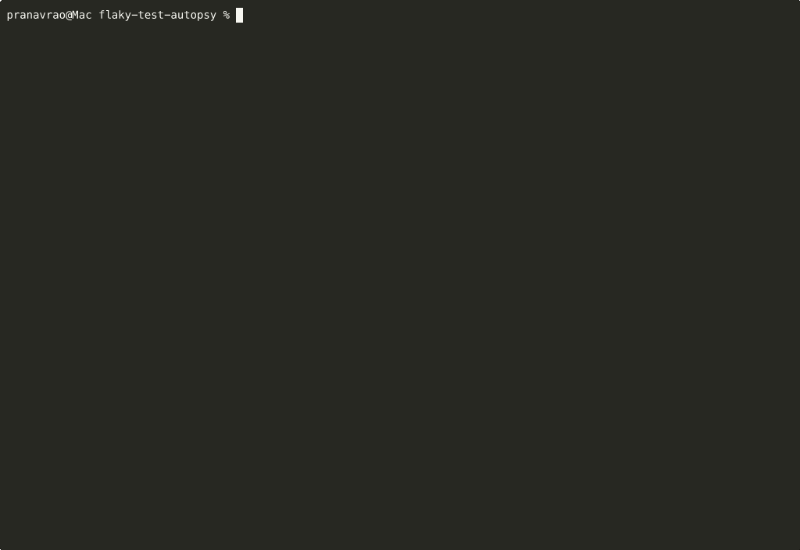
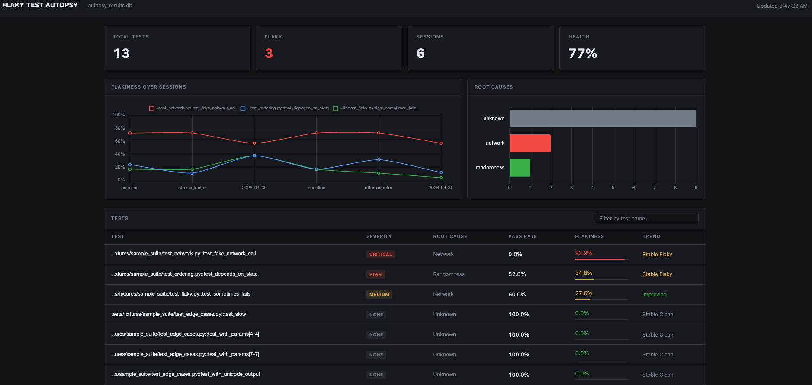

# Flaky Test Autopsy

> Detect flaky tests. Classify why. Get a fix.

[](https://pypi.org/project/flaky-test-autopsy)
[](https://pypi.org/project/flaky-test-autopsy)
[](https://github.com/PranavOaR/flaky/actions)
[](https://github.com/PranavOaR/flaky/blob/main/LICENSE)



---

## The problem

Flaky tests erode CI trust — teams learn to re-run failures without reading them, and real bugs hide behind habitual retries. Most tools just retry the test; they never tell you *why* it failed or how often it will keep failing.

## What Autopsy does differently

- **Detects** which tests are genuinely flaky using Wilson score confidence intervals, not raw pass rates
- **Classifies** each flaky test by root cause: ordering dependency, timing race, randomness, or network
- **Suggests fixes** — template code snippets plus optional AI-powered analysis via Claude
- **Tracks trends** across sessions so you know whether a flaky test is getting worse, improving, or newly introduced

---

## Install

```bash
pip install flaky-test-autopsy
```

---

## Quick start

```bash
# Run your suite 10 times with randomised order; score and classify results
autopsy run ./tests --runs 10

# Show scored results from a saved DB
autopsy score ./autopsy_results.db --explain

# Get fix suggestions for all flaky tests
autopsy fix ./autopsy_results.db

# Track trends across multiple sessions
autopsy trend ./autopsy_results.db
```

---

## Commands

### `autopsy run <path>`

Runs your pytest suite `--runs` times with a new random seed each time (via `pytest-randomly`). Results are written to `autopsy_results.db` in the current directory.

```bash
autopsy run ./tests --runs 20 --label "post-refactor"
autopsy run ./tests --runs 5 --fresh        # wipe old data first
```

After running, prints a scored summary table:

```
 Test                                     Runs  Pass rate  Flakiness  Severity  Root cause
 tests/test_flaky.py::test_sometimes        20      50.0%      26.4%    MEDIUM  randomness
 tests/test_order.py::test_depends_on_a     20      45.0%      22.3%    MEDIUM  ordering
 tests/test_stable.py::test_always_passes   20     100.0%       0.0%      NONE  —
```

### `autopsy score <db_path>`

Re-score results from an existing DB without re-running tests.

```bash
autopsy score ./autopsy_results.db
autopsy score ./autopsy_results.db --explain        # show evidence bullets
autopsy score ./autopsy_results.db --all            # include stable tests
autopsy score ./autopsy_results.db --threshold 0.1  # stricter threshold
autopsy score ./autopsy_results.db --json           # machine-readable output
```

### `autopsy fix <db_path>`

Generate fix suggestions for every flaky test.

```bash
autopsy fix ./autopsy_results.db
autopsy fix ./autopsy_results.db --ai              # Claude-powered analysis
autopsy fix ./autopsy_results.db --output fixes.md # write Markdown report
autopsy fix ./autopsy_results.db --ai --model claude-sonnet-4-6
```

The AI model is also configurable via the `AUTOPSY_AI_MODEL` environment variable (default: `claude-opus-4-7`).

### `autopsy trend <db_path>`

Compare flakiness across sessions and detect regressions.

```bash
autopsy trend ./autopsy_results.db
autopsy trend ./autopsy_results.db --regressions-only
autopsy trend ./autopsy_results.db --output trend_report.md
```

### `autopsy ci <path>`

Composite command designed for CI pipelines. Runs the suite, scores results, compares against a baseline, and exits 0 (clean), 1 (regressions detected), or 2 (error).

```bash
autopsy ci ./tests --runs 5 --baseline ./baseline/autopsy_results.db --output report.md
autopsy ci ./tests --runs 5 --json-output report.json   # for downstream tooling
```

### `autopsy dashboard <db_path>`

Serve a local web dashboard with summary cards, a Chart.js flakiness trend chart, and a sortable, filterable test table.

```bash
autopsy dashboard ./autopsy_results.db
autopsy dashboard ./autopsy_results.db --port 9000 --no-browser
```



### `autopsy init-ci`

Generate a `.github/workflows/flaky-tests.yml` workflow that runs on push, pull request, and a nightly cron schedule.

```bash
autopsy init-ci --runs 10 --schedule "0 3 * * *"
```

---

## CI Integration

Use `autopsy ci` on every PR to catch regressions before merge. The workflow below saves the baseline DB as an artifact on `main` pushes, then downloads and compares on PRs.

```yaml
name: Flaky Test Detection

on:
  push:
    branches: [main]
  pull_request:
  schedule:
    - cron: '0 2 * * *'

jobs:
  flaky-tests:
    runs-on: ubuntu-latest
    steps:
      - uses: actions/checkout@v4

      - uses: actions/setup-python@v5
        with:
          python-version: '3.11'

      - name: Install dependencies
        run: |
          pip install flaky-test-autopsy
          pip install -r requirements.txt

      - name: Download baseline DB (if exists)
        uses: actions/download-artifact@v4
        with:
          name: autopsy-baseline
          path: ./baseline
        continue-on-error: true

      - name: Run flaky test detection
        run: |
          autopsy ci . --runs 10 \
            --baseline ./baseline/autopsy_results.db \
            --output autopsy_ci_report.md

      - name: Upload results as artifact
        if: always()
        uses: actions/upload-artifact@v4
        with:
          name: autopsy-baseline
          path: autopsy_results.db

      - name: Upload CI report
        if: always()
        uses: actions/upload-artifact@v4
        with:
          name: autopsy-report
          path: autopsy_ci_report.md
```

---

## Root cause categories

| Category | What it means |
|----------|---------------|
| `ordering` | Test relies on execution order — passes alone, fails when another test runs first |
| `timing` | Race condition or brittle sleep/timeout that fails under load or slow CI |
| `randomness` | Unseeded `random`, `uuid`, or hash seed causing non-deterministic behavior |
| `network` | Test hits a real endpoint or DNS; fails when the network is slow or unavailable |

---

## How the scoring works

Autopsy uses the **Wilson score lower bound** (95% confidence) rather than raw failure rate. A test that failed 1 time in 5 runs might just be bad luck; Wilson score accounts for sample size and returns a conservative lower bound on the true failure rate. `flakiness_score` is this lower bound — a test is considered flaky when it exceeds 0.05 (5%). Severity bands: low ≤ 10%, medium ≤ 30%, high ≤ 60%, critical > 60%. This approach eliminates false positives from small sample sizes and gives you a number you can track over time.

---

## Contributing

See [CONTRIBUTING.md](CONTRIBUTING.md) for setup instructions, how to add a new root cause classifier, and PR requirements.

---

## License

MIT — see [LICENSE](LICENSE).

---

## Releasing a new version

1. Bump version in `pyproject.toml`
2. Add entry to `CHANGELOG.md`
3. `git tag v0.1.0 && git push --tags`
4. Create a GitHub Release — PyPI publish triggers automatically

## Roadmap

- [ ] VS Code extension
- [ ] GitLab CI native integration
- [ ] JavaScript/Jest support
- [ ] Flakiness heatmap by file/module
- [ ] Slack/Discord notifications for regressions
- [ ] `autopsy watch` — continuous monitoring mode
